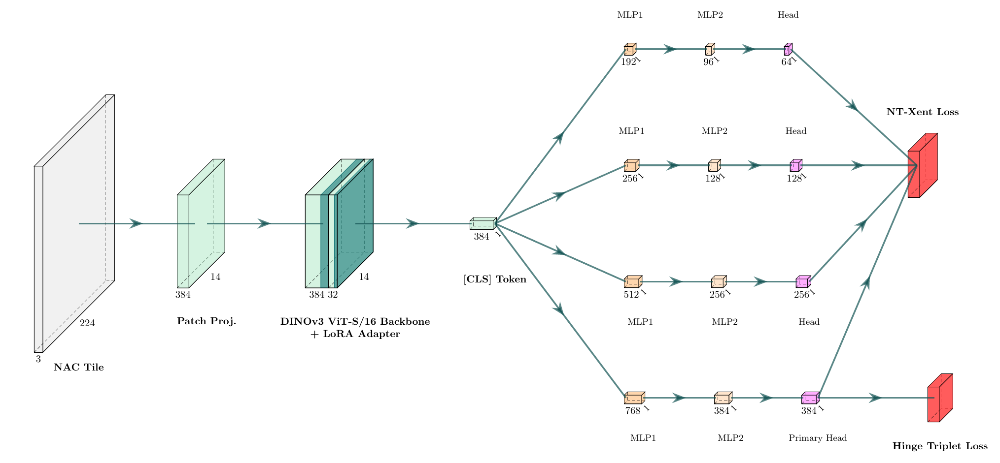
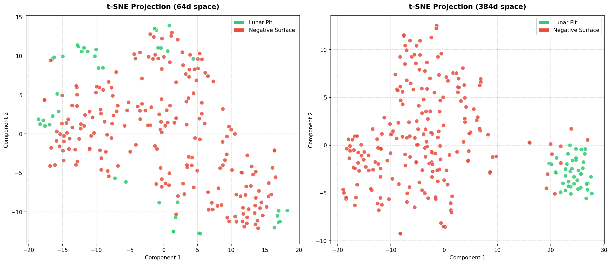
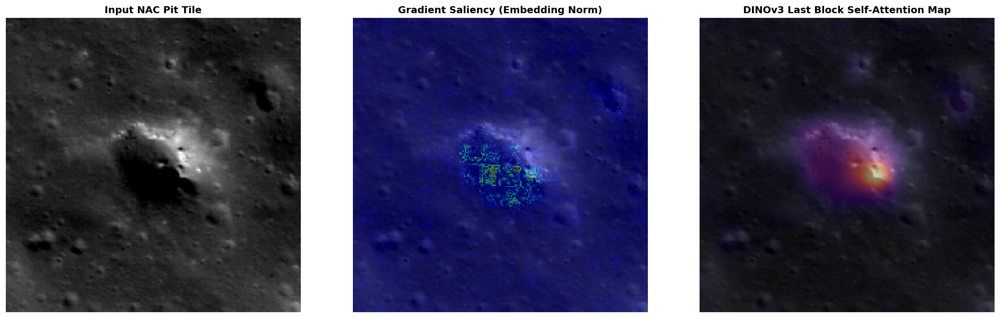
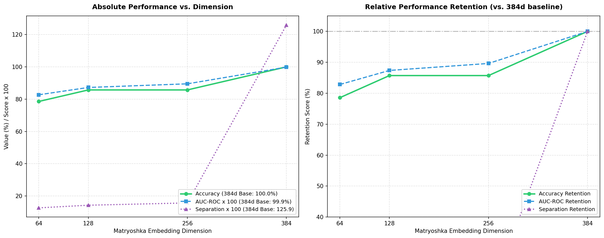
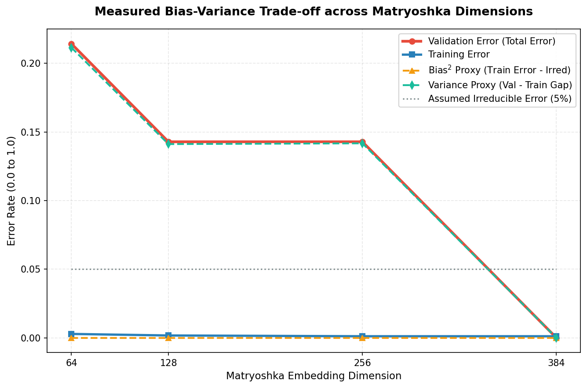

# Lunar DINOv3 LoRA (F1nnSBK/lunar-dinov3-lora)

This model card describes the LoRA adapter fine-tuned on top of the **DINOv3 (ViT-S/16)** vision backbone under **Project HOLE** (**H**ole-**O**riented **L**oRA **E**mbedder). The model maps lunar surface terrain tiles (represented as normalized Narrow Angle Camera (NAC) heights/pixels) to a metric embedding space optimized for distinguishing lunar pits from surrounding volcanic plains and negative control features.

## Model Details & Architecture

The HOLE model architecture fine-tunes a pretrained DINOv3 backbone via low-rank adaptation (LoRA). Instead of a standard linear classifier, it replaces the DINOv3 head with a **Matryoshka Projection Head**. This architectural decision is inspired by the **DIVE** (Dimensionality reduction with Implicit View Ensembles) framework by **Dongfang Zhao** (2026). DIVE allows us to train hierarchical, implicitly ensemble-like representations that don't suffer from overfitting on limited data.

By utilizing the `MatryoshkaDIVELoss`, which combines a self-limiting triplet loss on the primary head (384d) and a head-wise NT-Xent contrastive loss on the sub-dimensions (64d, 128d, 256d), the model builds a highly robust feature space.



- **Developed by:** F1nnSBK
- **Model type:** PEFT (LoRA) Adapter for DINOv3 Vision Transformer
- **Language(s):** English
- **License:** Apache 2.0
- **Base model:** `facebookresearch/dinov3_vits16` (fine-tuned from the pretrained `dinov3_vits16_pretrain_lvd.pth` weights)
- **PEFT Configuration:**
  - `peft_type`: `LORA`
  - `r (rank)`: `32`
  - `lora_alpha`: `32`
  - `target_modules`: `["qkv", "proj", "fc2", "fc1"]`
  - `lora_dropout`: `0.1`
  - `bias`: `"none"`

---

## Uses

### Direct Use
This model is designed to be loaded onto a pretrained DINOv3 backbone to extract 384-dimensional embeddings of lunar surface images. These embeddings are structurally grouped using triplet distance, allowing:
- Automatic clustering and cataloging of lunar pits and volcanic depressions.
- Feature similarity searches across newly acquired lunar NAC images.

### Out-of-Scope Use
- Not intended for general-purpose terrestrial image classification.
- Not tested for real-time hazard detection during automated spacecraft landings.

---

## How to Get Started

Use the code snippet below to load the base DINOv3 backbone and apply the PEFT/LoRA adapter from Hugging Face:

```python
import torch
import torch.nn as nn
from peft import PeftModel

# 1. Initialize base DINOv3 ViT-S/16 backbone
base_model = torch.hub.load("facebookresearch/dinov3", "dinov3_vits16", pretrained=False)

# 2. Load the base pre-trained weights (pretrain_lvd)
# (Ensure you download 'dinov3_vits16_pretrain_lvd.pth' to your local models directory)
state_dict = torch.load("models/meta/dinov3/dinov3_vits16_pretrain_lvd.pth", map_location="cpu")
if "model" in state_dict:
    state_dict = state_dict["model"]
base_model.load_state_dict(state_dict, strict=True)

# 3. Load the LoRA adapter from Hugging Face
model = PeftModel.from_pretrained(
    base_model, 
    "F1nnSBK/lunar-dinov3-lora", 
    adapter_name="pit_adapter"
)
model.eval()

# 4. Extract embeddings
# Input tensor shape: [batch_size, 3, 224, 224]
dummy_input = torch.randn(1, 3, 224, 224)
with torch.no_grad():
    embeddings = model(dummy_input)
print("Embedding shape:", embeddings.shape)  # Should output: [1, 384]
```

---

## Training Details

### Training Data
The dataset used for training is available on Hugging Face at [F1nnSBK/lunar-pits-dataset](https://huggingface.co/datasets/F1nnSBK/lunar-pits-dataset). It consists of curated Narrow Angle Camera (NAC) tiles containing:
- **Pits**: Volcanic pit crater coordinates.
- **Negatives**: Control volcanic regions, shallow craters, and shadow features.
- Data splits are partitioned dynamically using a **Group-Split based on NAC strip IDs** to prevent any data leakage between training and validation groups.

### Training Procedure
- **Loss Function:** Matryoshka Triplet Loss (dimensions optimized at `384`).
- **Mining Strategy:** Semi-Hard Triplet Mining.
- **Optimizer:** `AdamW` with learning rate of `1e-4` and weight decay `1e-2`.
- **Scheduler:** Sequential linear warmup (5 epochs) followed by cosine annealing.

---

## Evaluation & Metrics

The fine-tuned model (Epoch 12) exhibits exceptional performance on the validation set, achieving perfect separation on the full embedding dimension and maintaining strong performance even when truncated to smaller dimensions (Graceful Degradation).

### Matryoshka Embedding Metrics (Validation Set)

| Dim | Train Acc | Val Acc | Train AUC | Val AUC | Train Sep | Val Sep |
|-----|-----------|---------|-----------|---------|-----------|---------|
| **64**  | 99.7% | 78.6%  | 0.8315 | 0.8271 | 0.1366 | 0.1265 |
| **128** | 99.8% | 85.7%  | 0.8573 | 0.8724 | 0.1403 | 0.1428 |
| **256** | 99.9% | 85.7%  | 0.9070 | 0.8950 | 0.1389 | 0.1570 |
| **384** | 99.9% | **100.0%** | **0.9985** | **0.9985** | **1.3254** | **1.2592** |

## Visual Evaluation

The fine-tuned model exhibits distinct feature localization and a robust clustering capability in the embedding space.

### 1. t-SNE Embedding Projection
Dimensionality reduction of the 384d validation embeddings shows a clear separation between lunar pits and negative control regions.


### 2. Saliency & Attention Maps
The DINOv3 backbone focus is mapped directly to the structural elements (rims, shadows) of the lunar pits.


### 3. Matryoshka Representation Analysis
The DIVE training guarantees a graceful decay in performance even when truncating the embeddings. The Bias-Variance tradeoff demonstrates stable learning across dimensionalities.



---

## Local Repository Setup & Scripts

If you have cloned this repository locally, you can use the following scripts to reproduce training, split datasets, and generate evaluation figures.

### Setup Environment
```bash
python3 -m venv .venv
source .venv/bin/activate
pip install -r requirements.txt
```

### Run Scripts
- **Upload Dataset**: Uploads the processed dataset folder (`data/processed/dataset`) to your Hugging Face Datasets repository:
  ```bash
  python upload_dataset.py
  ```
- **Dataset Generation**: Splits raw PNG/NPY files under `data/processed/dataset/` into `train` and `test` subfolders:
  ```bash
  python create_dataset.py
  ```
- **Stats Builder**: Generates normalization percentiles:
  ```bash
  python build_stats.py
  ```
- **Training**: Runs training and logs to MLflow:
  ```bash
  python main.py --epochs 20
  ```
- **Equivariance Evaluation**: Generates `luna_fig_equivariance_qual_lora...` and `luna_fig_equivariance_quant_lora...` figures:
  ```bash
  python luna_acid.py
  ```
- **Saliency Differences**: Generates the comparison figures showing fine-tuned vs. zero-shot saliency differences:
  ```bash
  python luna_diff.py
  ```
